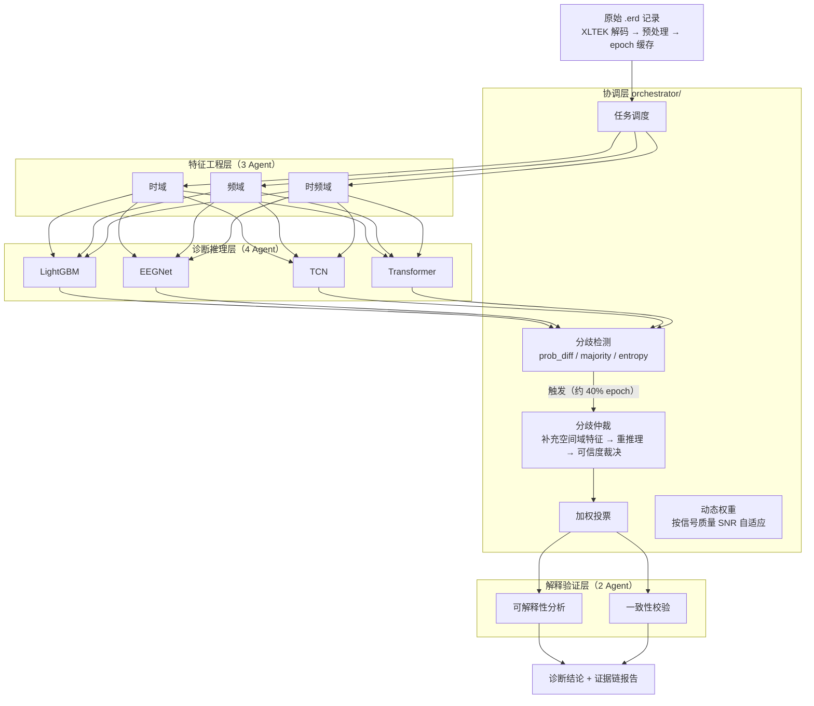

# EEG 多智能体辅助诊断系统

基于多 Agent 协作的儿童脑电（EEG）自动诊断系统。针对**界限性（Borderline）EEG 等边界样本**设计，通过四种不同归纳偏置的模型协作、分歧检测与可信度仲裁，提升诊断的准确性与一致性，并输出带证据链的可解释报告。

- **任务**：EEG 三分类（Normal / Borderline / Abnormal）+ 二分类口径（Normal vs Abnormal）
- **数据**：XLTEK/Natus 私有格式（.eeg/.erd），19 通道 × 2 s × 250 Hz epoch
- **系统**：三层九 Agent 金字塔架构 + 协调层（加权投票、分歧仲裁、动态权重）

## 系统架构



**核心机制**：

1. **多 Agent 协作诊断** — LightGBM（统计特征）/ EEGNet / TCN / Transformer（深度模型）四种归纳偏置互补
2. **分歧仲裁** — epoch 级检测四 Agent 意见分歧，自动触发"补充空间域特征（43 维）→ 二次诊断（含时间翻转 TTA）→ 可信度裁决"
3. **动态权重** — 按 epoch 信号质量（SNR / 伪迹比例）自适应调整各 Agent 权重
4. **可解释性** — 特征重要性排序、跨 Agent 一致性得分、逐 epoch 证据链

## 目录结构

```
Agent/
├── README.md                        # 本文件
├── EEG-Multi-Agent System Plan.docx # 系统设计文档
├── 项目进展报告.md                   # 详细实验记录与结论
└── eeg_multi_agent/                 # 代码主目录
    ├── config.py                    # 全局配置（含校准后的 DISAGREEMENT_CONFIG）
    ├── agents/
    │   ├── base_agent.py            # Agent 基类（统一接口）
    │   ├── feature_agents/          # 时域 / 频域 / 时频域（3 个）
    │   ├── diagnosis_agents/        # LightGBM / EEGNet / TCN / Transformer（4 个）
    │   └── validation_agents/       # 可解释性 / 一致性（2 个）
    ├── orchestrator/                # 协调层：调度 / 投票 / 分歧 / 仲裁 / 动态权重
    ├── models/                      # 深度模型结构定义
    ├── data/                        # 清洗 / 标签映射 / XLTEK 解码 / epoch 缓存
    ├── training/                    # 训练脚本（run_all.py 一键全训）
    ├── scripts/                     # 全流程可执行脚本（见下文）
    ├── evaluation/                  # 评价指标
    ├── utils/                       # 信号处理 / 事件检测 / 空间特征等
    ├── outputs/                     # 实验结果 JSON 与样例报告
    └── checkpoints/                 # 模型权重（不入库，见数据隐私）
```

## 环境与安装

- Python 3.8+（开发环境 3.12）
- 依赖见 `eeg_multi_agent/requirements.txt`

```bash
pip install -r eeg_multi_agent/requirements.txt
```

## 快速开始

以下命令均在 `eeg_multi_agent/` 目录下执行。完整流水线：**清洗 → 索引 → 缓存 → 训练 → 评估 → 报告**。

```bash
cd eeg_multi_agent

# 1. 病例表清洗（输出 data/subject_master.csv，需原始病例 xlsx，见数据隐私）
python -m data.cleaner

# 2. 记录级主表（记录 ↔ EEG 文件 ↔ 标签 ↔ 划分，输出 data/record_index.csv）
python -m data.build_record_index

# 3. 构建 epoch 缓存（多进程，约 100 分钟 / 1598 条记录，约 6 GB）
python scripts/build_epoch_cache.py --workers 12

# 4. 快速自检（读 10 秒原始信号验证解码）
python scripts/probe_read.py --seconds 10

# 5. 训练四个诊断 Agent（LightGBM / EEGNet / TCN / Transformer）
python training/run_all.py

# 6. 批量评估（epoch 级 + 被试级双口径 + 融合）
python scripts/run_batch_evaluation.py

# 7. 单样本诊断演示 / 生成单病例可解释报告
python scripts/run_single_diagnosis.py
python scripts/generate_report.py

# 8. 分歧阈值校准（val 集网格搜索）
python scripts/calibrate_disagreement.py

# 9. 系统消融（含 McNemar 显著性检验与信号质量分层）
python scripts/run_ablation_system.py
```

> 权重默认从 `checkpoints/` 读取；没有权重时深度 Agent 退化为随机初始化占位模式。

## 数据集

| 项目 | 数值 |
|---|---|
| 受试者 | 1778（每人取首次记录，避免跨集泄漏） |
| 记录 | 1598（train 1119 / val 240 / test 238，按标签分层） |
| epoch 缓存 | 158,701 个（1589 条记录成功） |
| epoch 规格 | 19 通道 × 2 s × 250 Hz，50% 重叠 |
| 标签分布 | Normal 54.5% / Abnormal 33.8% / **Borderline 11.6%**（严重不平衡） |
| 信号质量 | SNR 中位 18.3 dB，伪迹比例中位 1.7%，epoch 保留率中位 0.912 |

**预处理流水线**：500 Hz → 带通 0.5–45 Hz → **50 Hz 陷波**（工频干扰最高占 63% 能量，必须先陷波）→ 降采样 250 Hz → 平均参考 → 按记录峰峰值中位数 3 倍自适应伪迹剔除 → 每记录均匀抽样 ≤100 epoch（跳过开头 60 s，读取 600 s）。

**XLTEK .erd 解码**（`data/xltek_reader.py`，修正参考实现三处错误）：2 字节增量为小端；µV/LSB 标定中 `<<discardbits` 只乘一次；首个增量缺绝对值基准时以首增量作基准。与参考实现逐包比对 3000 包 0 不一致，绝对值锚点误差 0.276 µV。

## 实验结果

test 集（238 名被试，每记录 20 epoch）。**多数类基线 = 0.5504**，三分类随机水平 = 0.333。

### 被试级（临床口径）

| 模型 | Accuracy | macro-F1 |
|---|---|---|
| LightGBM | **0.5966** | 0.410 |
| Transformer | 0.5504 | — |
| EEGNet | 0.5462 | — |
| TCN | 0.5042 | — |
| 融合（epoch 投票聚合） | 0.5546 | — |
| 融合（被试级意见加权投票） | 0.5672 | 0.394 |

### epoch 级（2 秒片段）

| 模型 | Accuracy |
|---|---|
| Transformer | 0.5401 |
| EEGNet | 0.5372 |
| 融合系统 | 0.5370（AUC 0.628） |
| LightGBM | 0.4939 |
| TCN | 0.4750 |

### 二分类口径（Normal vs Abnormal，剔除 Borderline）

| 口径 | test acc | macro-F1 | 基线 |
|---|---|---|---|
| 被试级（20 epoch 聚合） | **0.6286** | 0.604 | 0.6238 |

事件级特征 A/B 对照：癫痫样放电等事件特征使二分类 accuracy **+0.021**（`scripts/_eval_event_features.py`）。

### 系统消融（口径：test@20，被试 = epoch 平均概率）

| 变体 | epoch acc | 被试 acc |
|---|---|---|
| Full（动态权重 + 仲裁） | 0.5044 | 0.5378 |
| A7 去仲裁 | 0.5038 | 0.5294 |
| A8 固定权重 | 0.5015 | **0.5420** |
| A9 等权重 | 0.5235 | 0.5294 |

McNemar 精确检验（被试级）：各变体与 Full 差异均不显著（p ≥ 0.5）。信号质量分层：99.2% epoch 为高质量，低质量子集过小，动态权重优势未达显著。

## 亮点：分歧检测阈值校准

原始阈值（0.15 / 0.6 / 0.8）触发率 **100%** —— 四 Agent 平均概率接近均匀（中位熵 1.0878 ≈ ln3 = 1.0986），熵规则完全失效。经 `scripts/calibrate_disagreement.py` 在 val 集（4800 epoch）网格搜索校准：

```python
DISAGREEMENT_CONFIG = {
    "prob_diff_threshold": 0.30,      # 最大概率差阈值
    "label_majority_threshold": 0.6,  # 标签一致比例阈值（2-2 / 2-1-1 分裂时触发，核心规则）
    "entropy_threshold": 1.099,       # 熵阈值（>ln3 不可能，仅极端均匀时触发）
    "arbitration": "weighted_vote",
}
```

校准效果（见 `config.py` 注释与 `outputs/disagreement_calibration.json`）：

- 触发率 100% → **39.7%**（恢复选择性仲裁）
- val 被试精度持平最优（0.5833），epoch 精度最高（0.5417）
- 推理成本**约减半（-39%）**

## 关键发现

1. **判别信息主要在被试级**：epoch 级最佳单特征 AUC 仅 0.59，被试内多 epoch 平均后升至 0.65–0.726
2. **取样窗口以记录开头最好**（skip 60s 的 AUC 0.726，优于 15/30/60 min），现有策略合适
3. **Borderline 类基本学不到**（F1 ≈ 0.04）：仅占 11.6% 且临床定义模糊，属预期；建议论文单列或合并为"可疑"档
4. **融合未超最优单 Agent**：弱模型在逐片段投票中稀释强模型，被试级融合（0.5672）仍低于 LightGBM（0.5966）

详细实验记录与结论见[项目进展报告.md](项目进展报告.md)。

## 数据隐私声明

本项目使用真实临床脑电与病例数据，**以下内容已通过 `.gitignore` 排除、严禁上传**：

| 文件 | 说明 |
|---|---|
| `*.xlsx`（脑电+病例原始备份） | 原始病例表（1037 条记录，含患者标识） |
| `eeg_multi_agent/data/subject_master.csv` | 清洗后主表（含匿名 ID 映射） |
| `eeg_multi_agent/data/record_index.csv` | 记录索引（含本地数据路径） |
| `eeg_multi_agent/checkpoints/` | 模型权重（可由 `training/run_all.py` 重新生成） |

复现实验需自备同格式临床数据并本地执行完整流水线；仓库仅含代码、配置与聚合统计结果（均为匿名/聚合口径）。

## 论文引用

待补充。
